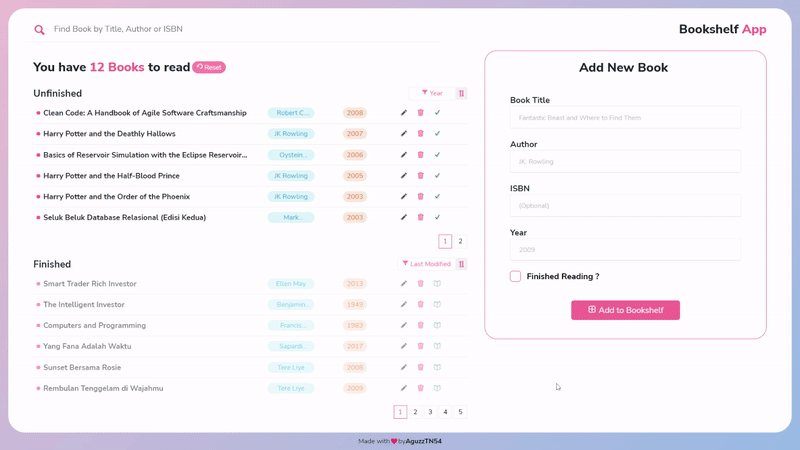
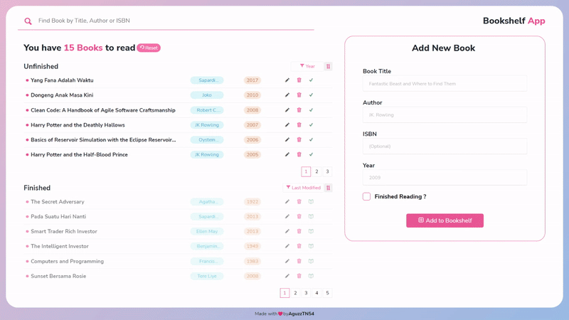

# Bookshelf App

Simple Web App built with Vanilla JS without Build Tools and without any frameworks or libraries, so you can run this web app with or without Web Server. This Web App use `LocalStorage` to store data, consume and show it to User

### Features

- User can Add or Edit a Book
- Filtering by `Recently Modified`, `Recently Added`, `Title`, `Author` or `Year`
- Group by `Finished` or `Unfinished` read status
- Remove a specific book or the entire data from localstorage
- User can find the book(s) by searching with book's `title`, `author`, or `isbn`

---

### Screenshot

> Example of Dicoding Submission : **Aplikasi Pengelolaan Data Menggunakan DOM dan Web Storage**
>
> Learning Path **Belajar Membuat Front-End Web untuk Pemula**
